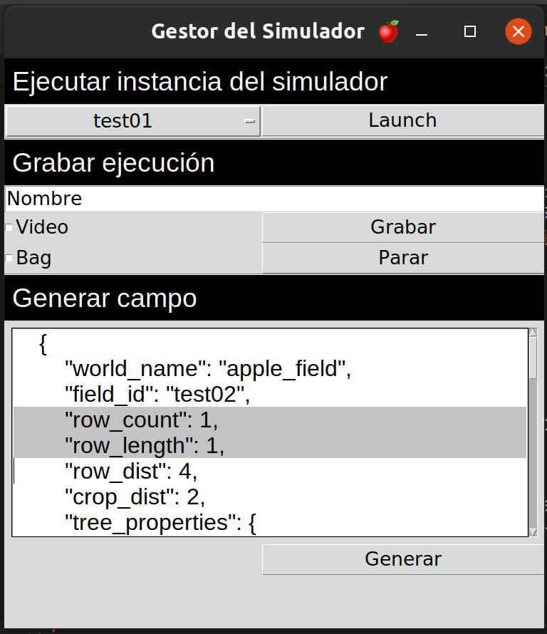
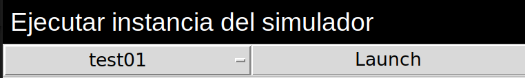
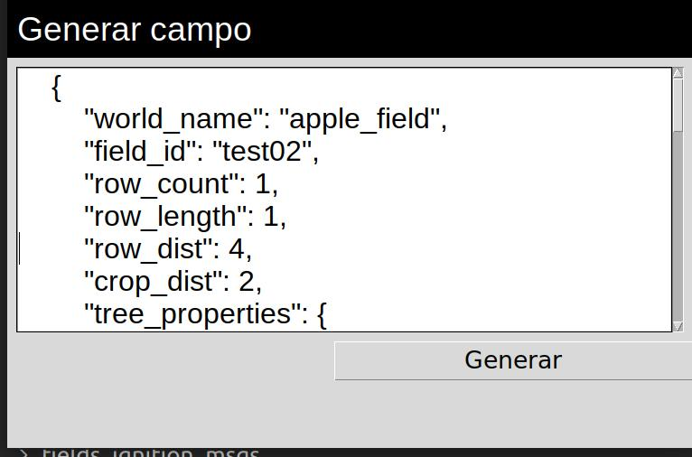

# fields-ignition

### _Generador de campos aleatorios para ignition Gazebo_

#### Adaptación del proyecto [fields ignition](https://github.com/azazdeaz/fields-ignition) para campos de manzanas.

- [Sobre el proyecto](#sobre-el-proyecto)
- [Notas](#notas)
- [Ejecutar en un Catkin workspace](#ejecutar-en-un-catkin-workspace)
- [Interfaz de gestión](#interfaz-de-gestión)

## Sobre el proyecto

En el contexto del proyecto de grado, cuyo objetivo es evaluar distintos algoritmos de detección y conteo de manzanas, surge el problema de conseguir datos con los cuales experimentar. Es por esto que surge la posibilidad de adaptar el proyecto [fields ignition](https://github.com/azazdeaz/fields-ignition), que genera campos de tomates para simular ambientes de prueba para robots agrícolas, de forma tal de generar campos de manzanas.

## Ejecutar en un Catkin workspace

### Instalar Ros Noetic y crear un Catkin workspace

- [http://wiki.ros.org/noetic/Installation](http://wiki.ros.org/noetic/Installation)
- [http://wiki.ros.org/catkin/Tutorials/create_a_workspace](http://wiki.ros.org/catkin/Tutorials/create_a_workspace)
  - Se asume que el workspace se crea en `~/catkin_ws/`

### Instalar Ignition Fortress

- `apt-get -q -y install ignition-fortress`

### Instalar ros-ign para Fortress

- https://github.com/gazebosim/ros_gz/tree/noetic

#### Nota: Para ignition Fortress solo se puede instalar desde Source. Definiendo `export IGNITION_VERSION=fortress`.

### Instalar Blender

Para generar los campos de manzanas se debe tener instalado Blender en su versión 3.3.

- [https://www.blender.org/download/](https://www.blender.org/download/)

#### Nota: Con versiones más nuevas de Blender, las texturas no son cargadas en Ignition.`.

### Instalar Fields Ignition

- `git clone https://gitlab.fing.edu.uy/facundo.gutierrez/apple_fields_ignition` en la carpeta src del workspace
- `rosdep install --from-paths src --ignore-src -r -y` en la carpeta del workspace
- ejecutar `catkin_make`

## Interfaz de gestión

Se provee una interfaz de gestión que permite lanzar, grabar y generar instancias del simulador.

Para lanzar la interfaz se debe ejecutar el comando:

- `source devel/setup.sh` en la carpeta del workspace.

Y luego

- `roslaunch fields_ignition fields_ignition.launch`

Abriéndose la siguiente interfaz:

     

### Lanzar instancia

Para lanzar una instancia del simulador se debe elegir una de las opciones de la lista desplegable y luego hacer clic en launch.

     

### Grabar bags y videos

Para grabar un recorrido del simulador, se debe definir el nombre del recorrido, seleccionar si se desea grabar el bag o el video, y posteriormente hacer clic en "Grabar".

Para finalizar la grabación se debe presionar "Parar". Esto genera un directorio `<fields_ignition>/generated/<instancia>/experiments/<nombre_del_experimento>` en el directorio de la instancia seleccionada, donde se guarda el video y el bag grabados.

#### Nota: Todos los tópicos publicados son grabados.

### Generar una nueva instancia del simulador

Para generar un nuevo campo de manzanas se debe modificar el JSON del campo de texto y hacer clic en "Generar". Para más detalles del funcionamiento ver [Generación de campos de manzanas](./fields_ignition/Readme.md)

     

Los detalles de cada campo del JSON se detallan a continuación:

| **Propiedad**            | **Descripición**                                                                                                                |
| ------------------------ | ------------------------------------------------------------------------------------------------------------------------------- |
| _world_name_             | Nombre del mundo generado.                                                                                                      |
| _field_id_               | Nombre identificador de la instancia del simulador. Si se mantiene un valor existente, se sobrescribe.                          |
| _row_count_              | Cantidad de filas.                                                                                                              |
| _row_length_             | Cantidad de árboles por fila.                                                                                                   |
| _row_dist_               | Distancia entre cada fila.                                                                                                      |
| _crop_dist_              | Distancia entre árboles por fila.                                                                                               |
| _tree_properties_        | Propiedades de los árboles generados.                                                                                           |
| _origin_coordinates_     | Coordinadas de origen para la posición de los árboles.                                                                          |
| _camera_position_        | Posición inicial de la cámara. Ver: _"pose"_ en [SDF Camera Sensor](http://sdformat.org/spec?ver=1.9&elem=sensor#sensor_camera) |
| _husky_initial_position_ | Posición inicial del robot. Ver: _"pose"_ en [SDF World Model](http://sdformat.org/spec?ver=1.9&elem=model#world_model)         |

#### **Propiedades del árbol**

Acá se listan las propiedades más importantes. Para ver todas las propiedades, además de cómo ejecutar de manera independiente la generación de árboles, ver [Generación de árboles de manzanas](./fields_ignition/blender/README.md).

| **Propiedad**             | **Descripición**                                           |
| ------------------------- | ---------------------------------------------------------- |
| _fruits/count_proportion_ | Probabilidad de agregar una fruta en un nodo. Rango: [0,1] |
| _fruits/size_range_       | Intervalo de tamaños de las frutas en metros.              |
| _leaf/count_proportion_   | Probabilidad de agregar una hoja en un nodo. Rango: [0,1]  |
| _leaf/size_range_         | Intervalo de tamaños de las hojas en metros.               |
