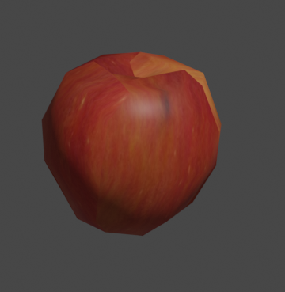

# Generación de árboles

Los árboles de manzanas se generan utilizando la [api](https://docs.blender.org/api/current/index.html) de Blender para Python, en el script `apple_gen.py`.

## Requerimientos

Para ejecutar el script es necesario instalar Blender en su versión 3.3.

- [https://www.blender.org/download/](https://www.blender.org/download/)

## Forma de uso

```console
comando: blender apple_tree.blend [--background] --python apple_gen.py -- --model_dir {dest_dir}  -f {configuration_file} [-s seed] --model [--metadata] [--video]

argumentos:
    --background        Ejecuta blender en segundo plano.
    -o, --model-dir     Directorio de destino de los archivos. Por
                        defecto: `/generated/test_apple`
    -f, --file          Archivo de parámetros del arbol.
    -s, --seed          Seed para numpy.
    --model             Exporta el modelo en formato .dae.
    --metadata          Exporta un archivo .txt con la posición de
                        las hojas y manzanas.
    --video             Exporta un video que muestra una vista de 360°
                        del árbol.
```

## Archivo de parámetros

Es un archivo en formato JSON que determina los parámetros que definen al árbol. Un ejemplo de este archivo es el siguiente:

```json
{
  "main": {
    "elements_offset_range": [0.5, 0.6],
    "height_range": [2.2, 2.3]
  },
  "branches": {
    "count": 1,
    "radius_range": [0.05, 0.07],
    "radius_decrease": 0.2,
    "brindillas": {
      "offset_range": [0.5, 0.6],
      "length_range": [0.2, 1.0],
      "distance_between": [0.02, 0.03],
      "radius_range": [0.006, 0.01],
      "radius_decrease": 0.2
    }
  },
  "fruits": {
    "count_proportion": 0.2,
    "size_range": [0.065, 0.07]
  },
  "leaves": {
    "count_proportion": 0.2,
    "size_range": [0.1, 0.15]
  }
}
```

> **Nota**
> Los parámetros de tipo rango corresponden al intervalo en el cual se puede tomar el valor del parámetro de forma aleatoria.

#### Main

Propiedades que definen al árbol.

| **Nombre**              | **Tipo** | **Descripción**                                                      |
| ----------------------- | -------- | -------------------------------------------------------------------- |
| _elements_offset_range_ | Rango    | Altura mínima a partir de la cual puede haber ramas, hojas o frutas. |
| _height_range_          | Rango    | Altura máxima del árbol.                                             |

#### Branches

Propiedades que describen las ramas del árbol.

| **Nombre**          | **Tipo** | **Descripción**                                                                                    |
| ------------------- | -------- | -------------------------------------------------------------------------------------------------- |
| _count_             | Número   | Cantidad de ramas principales.                                                                     |
| _radius_range_      | Rango    | Grosor de la rama                                                                                  |
| _radius_decrease_   | Número   | Factor de reducción del grosor de la rama hacia el extremo.                                        |
| _brindillas_        | JSON     | Parámetros correspondientes a las ramas secundarias. Que contienen las manzanas y hojas.           |
| _>offset_range_     | Rango    | Distancia desde el inicio de la rama principal a partir de la cual pueden haber ramas secundarias. |
| _>length_range_     | Rango    | Largo de las ramas secundarias                                                                     |
| _>distance_between_ | Rango    | Distancia entre las ramas secundarias.                                                             |
| _>radius_range_     | Rango    | Grosor de las ramas secundarias.                                                                   |
| _>radius_decrease_  | Rango    | Factor de reducción del grosor de las ramas secundarias.                                           |

### Fruits

| **Nombre**         | **Tipo** | **Descripción**                                            |
| ------------------ | -------- | ---------------------------------------------------------- |
| _count_proportion_ | Número   | Probabilidad de agregar una fruta en un nodo. Rango: [0,1] |
| _size_range_       | Rango    | Tamaño de la fruta.                                        |

La textura de la manzana se elige de forma aleatoria entre cuatro imágenes precargadas. Un ejemplo de manzana es el siguiente:



### Leafs

| **Nombre**         | **Tipo** | **Descripción**                                           |
| ------------------ | -------- | --------------------------------------------------------- |
| _count_proportion_ | Número   | Probabilidad de agregar una hoja en un nodo. Rango: [0,1] |
| _size_range_       | Rango    | Tamaño de la hoja.                                        |

Un ejemplo de hoja es el siguiente:


